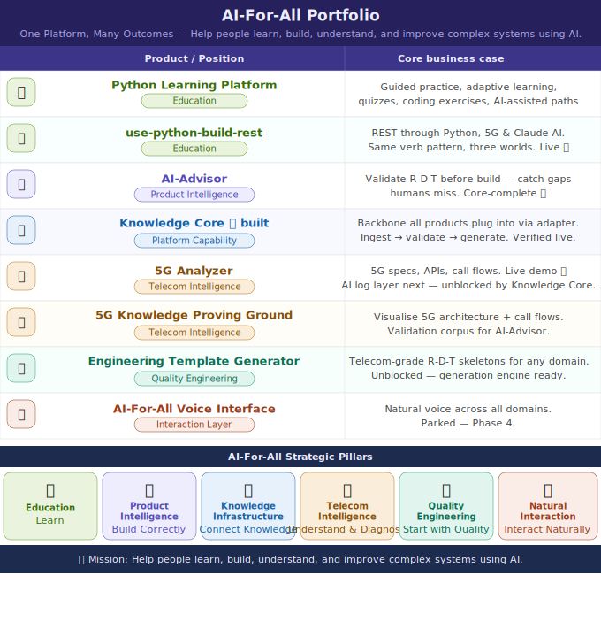

# AI-For-All

**Help people learn, build, understand, and improve complex systems using AI.**

AI-For-All is a product ecosystem built by [Aditya Madduri](https://github.com/sagarmapv) — an Enterprise AI & Distributed Systems Architect with a background in telecom, APIs, and applied AI.

🌐 **[ai-for-all homepage](https://sagarmapv.github.io/ai-for-all/)**

---



---

## The backbone

Every AI-For-All product is powered by a single reusable engine — the **Knowledge Core**.

```
Your documents (Requirements, Design, Tests, logs, specs)
        ↓  your adapter
  Knowledge Core
  ingest → chunk → embed → validate → generate
        ↓
  gaps detected · drafts produced · questions answered
```

Any product in this ecosystem plugs in one adapter and inherits the full validation intelligence. The engine never touches files directly — adapters do. The core stays clean.

**Built and verified:** 1043 nodes / 725 gaps on the 5G demo corpus. Two products already consuming it.

---

## Products

### AI-Advisor — *Product Intelligence* · flagship
> Software fails where the inputs were incomplete — not where the code was wrong.

AI-Advisor catches that failure before it happens. Feed it your Requirements, Design, and Tests — it finds gaps, checks consistency, traces coverage, and drafts what is missing. Runs locally (Ollama), on a local k8s cluster, or against the Anthropic API.

- Validation against ISO/IEC/IEEE 29148, ISO 42010, IEEE 1016, ISTQB, ISO 25010
- Hierarchical traceability — drill from epic to sub-clause
- Design generation (B6) and test draft generation from gaps
- Multi-user safe, model-picker, CLI + API + wizard UI

**Repo:** [ai-advisor](https://github.com/sagarmapv/ai-advisor) *(private)*

---

### 5G Analyzer — *Telecom Intelligence*
> Understand 5G specifications, call flows, and network behaviour — fast.

**Live demo:** [sagarmapv.github.io/5g-yaml-analyzer](https://sagarmapv.github.io/5g-yaml-analyzer/)

Parses 3GPP OpenAPI YAML specs into an interactive Explorer (NF → Services → SBI messages), Topology graph, Master Story flows, and Ladder sequence diagrams. The AI log-correlation layer — upload a debug log, identify which call flow and where it is stuck — is next, powered by the Knowledge Core.

**Repos:** [5g-yaml-analyzer](https://github.com/sagarmapv/5g-yaml-analyzer) *(public)* · [5g-visualizer](https://github.com/sagarmapv/5g-visualizer) *(private)*

---

### Engineering Template Generator — *Quality Engineering*
> 3GPP-grade quality skeletons for any domain — lean but strong enough to build on.

Telecom specifications are among the most rigorously structured requirements documents in engineering. This product extracts that pattern and generates lightweight Requirements/Design/Test skeletons for any product team that wants to start with quality instead of retrofitting it.

*Roadmap — Phase 3. Knowledge Core (B6 generation) already proven.*

---

## Education wing

### Python Learning Platform
> Build Python skills through guided practice, adaptive learning, and daily muscle memory.

14 topics mapped to the official Python tutorial, per-question wrong-attempt tracking, subtopic progress, and cloze-style recall. The adaptive daily loop — coding problems calibrated to your weak spots, memory tips, 30-day progression — is the next build.

**Repo:** [python-quiz-app](https://github.com/sagarmapv/python-quiz-app) *(public)*

---

### use-python-build-rest
> You learned Python. Now use it — and see the same REST pattern in 5G and AI.

**Live demo:** [sagarmapv.github.io/use-python-build-rest](https://sagarmapv.github.io/use-python-build-rest/)

Teaches GET / POST / PUT / PATCH / DELETE through three parallel worlds: a Python FastAPI server, 5G network functions (SBI interfaces), and the Claude AI API. REST is how everything talks to everything — only the payload changes.

**Repo:** [use-python-build-rest](https://github.com/sagarmapv/use-python-build-rest) *(public)*

---

## Innovation wing

### multi_agent_ai
> Fully local multi-agent architecture — FastAPI, JSON-RPC, MCP tool servers, no cloud.

Research Agent (L1) → specialised L2 agents → MCP tool servers backed by Pandas. Proof of concept for the agent orchestration layer that AI-Advisor's Phase 2 will build on.

**Repo:** [multi_agent_ai](https://github.com/sagarmapv/multi_agent_ai) *(private)*

---

### robot-bdd-poc
> Robot Framework + Playwright — telecom QA to generic SDET, with agentic thinking notes.

Real Robot Framework test cases (GWT-style), Playwright headless tests, and an `agentic_thinking/` folder that feeds directly into AI-Advisor's R-D-T ingestion model as a live test corpus.

**Repo:** [robot-bdd-poc](https://github.com/sagarmapv/robot-bdd-poc) *(public)*

---

## Roadmap

```
Phase 0  ✅ shipped    Python Learning Platform · use-python-build-rest

Phase 1  🟢 complete   AI-Advisor v1 core loop
                       Knowledge Core backbone (D1) — verified, two products consuming it
                       Next: H layer UX tables · D2 wire 5G Analyzer onto backbone

Phase 2  🟣 unblocked  5G Analyzer AI layer (D2)
                       Log → call flow → where stuck, powered by Knowledge Core
                       Python Learning Platform adaptive daily loop

Phase 3  📋 planned    AI-Advisor v2 · Engineering Template Generator
                       Full R-D-T multi-project · 3GPP skeletons for any domain

Phase 4  ⏸ parked     AI-For-All Voice Interface
                       Natural language across the full ecosystem
```

---

## Strategic pillars

| Pillar | Purpose |
|---|---|
| **Education** — Learn | Build skills through guided practice and adaptive learning |
| **Product Intelligence** — Build Correctly | Validate and connect Requirements, Design, and Tests before implementation |
| **Knowledge Infrastructure** — Connect Knowledge | The reusable backbone: ingest, chunk, embed, validate, generate |
| **Telecom Intelligence** — Understand & Diagnose | 5G specs, APIs, logs, and call flows — fast |
| **Quality Engineering** — Start with Quality | High-quality R-D-T skeletons from proven engineering patterns |
| **Natural Interaction** — Interact Naturally | Voice access across all domains — Phase 4 |

---

*Telecom was the proof. AI-For-All is the platform.*
*Built by Aditya Madduri — shipped with Claude.*
